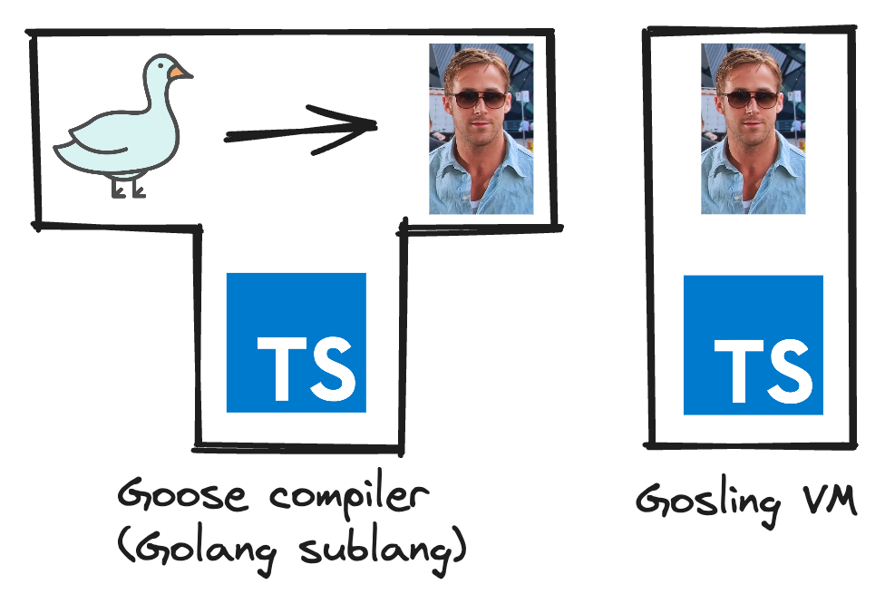

# goose

This is a CS4215 Project that demonstrates a compiler and a concurrent virtual machine. It consists of a Goose (our sublanguage of Golang) compiler, a Gosling (our VM's instruction language) interpreter, as well as a frontend to demonstrates its use.

Authors:

- Bharath Chandra Sudheer
- Hoang Trong Tan

---

### Copyright

<a href="https://www.flaticon.com/free-icons/goose" title="goose icons">Goose icons created by manshagraphics - Flaticon</a>

<a href="https://daman.co.id/style-icon-ryan-gosling">Gosling photo from daman.co.id</a>
