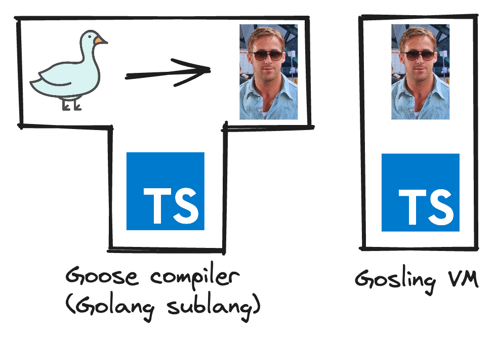
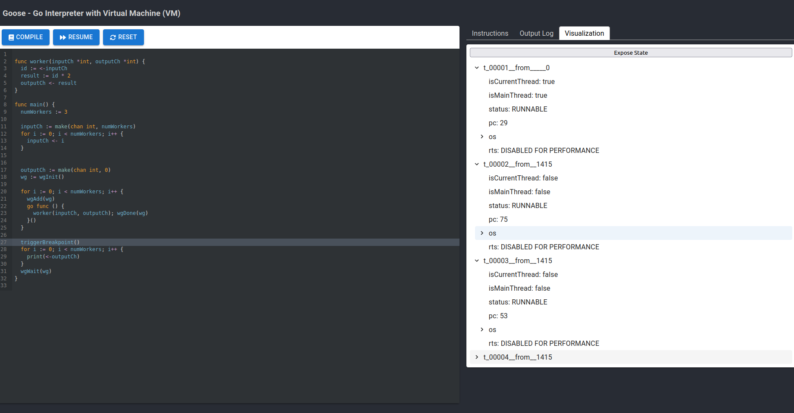

# goose

This is a CS4215 Project that demonstrates a compiler and a concurrent virtual machine. It consists of a Goose (our sublanguage of Golang) compiler, a Gosling (our VM's instruction language) interpreter, as well as a frontend to demonstrates its use. You can also find our presentation [here](https://hackmd.io/@oTAS25NTSSOiOfG0ri-H5A/HJXb9Pol0) (and [slides.md](./docs/slides.md))

Authors:

- Bharath Chandra Sudheer
- Hoang Trong Tan

---

## Demo

You can find a deployed version of the frontend with the "go-slang" dependency in [goose-liard.vercel.app](https://goose-liard.vercel.app/). It provides a code editor which shows the compiled instruction output, filtered log visualiser and a VM visualiser to inspect threads, operand stacks, and runtime stack at breakpoints.

## Install & Build Locally

Follow the instructions found in [./go-slang](./go-slang/README.md) and [./frontend](./frontend/README.md).

### Copyright

<a href="https://www.flaticon.com/free-icons/goose" title="goose icons">Goose icons created by manshagraphics - Flaticon</a>

<a href="https://daman.co.id/style-icon-ryan-gosling">Gosling photo from daman.co.id</a>
